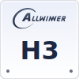
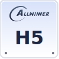
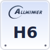
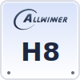
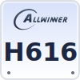
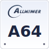

# allwinner-socs-logo

## SOC Logos Preview
|      |      |      |      |      |
| :--: | :--: | :--: | :--: | :--: |
|  |  |  |  |  |
| **H3** | **H5** | **H6** | **H8** | **H616** |

~~I suggest Allwinner's designer go have a good learn,~~  
~~And don't put your company chip logos under your official download page. (of course some PDFs.~~

## Generator
Usage: python allwinnersoclogo.py <output_svg_path> <chip_soc_name>  
Example: python allwinnersoclogo.py A64.svg "A64"

For the result the A64.svg will be:  
|      |
| :--: |
|  |
| **A64** |

## LICNSE
Licensed under MIT license with ❤️,  
Everyone can use these logos anywhere.
