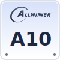
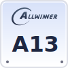
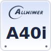
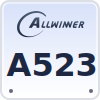
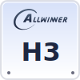
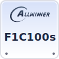
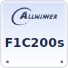
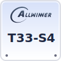
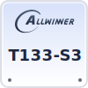
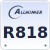

# allwinner-socs-logo

|      |      |      |      |      |
| :--: | :--: | :--: | :--: | :--: |
|  |  |  |  |  |
| **A10** | **A10s** | **A13** | **A40i** | **A523** |
|  |  |  |  |  |
| **H3** | **H5** | **H6** | **H8** | **H616** |
|  |  |  |  |  |
| **F1C100s** | **F1C200s** | **T33-S4** | **T133-S3** | **R818** |


Click [here](./svgs/) to view all models.

## To Generate The Logos
```bash
$ make
```

## About Template Generator
Usage: python allwinnersoclogo.py <output_svg_path> <chip_soc_name>  
Example: python allwinnersoclogo.py A64.svg "A64"

For the result the A64.svg will be:  
|      |
| :--: |
|  |
| **A64** |

## LICENSE
Licensed under MIT license with ❤️,  
Everyone can use these logos anywhere.

~~Actually I suggest Allwinner's designer go have a good learn,~~  
~~And don't put your company chip logos under your official download page. ( PDFs, please.~~
